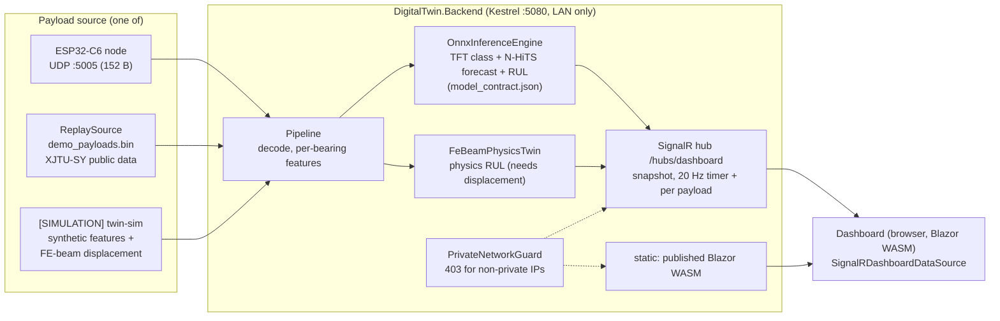

# Integration: backend + AI engine + twin + dashboard

Branch `feature/integration`. One process, one LAN URL: the ASP.NET Core backend ingests 152-byte COE payloads,
runs the trained TFT + N-HiTS ONNX models in-process, drives the physics twin, pushes `DashboardSnapshot` over
SignalR, and also serves the published Blazor WASM dashboard.

## Architecture



## Run

```powershell
./scripts/run-demo.ps1                     # replay of XJTU-SY public data, real ONNX models
./scripts/run-demo.ps1 -Mode twin-sim      # [SIMULATION] twin demo (physics RUL + residual populated)
./scripts/run-demo.ps1 -Bind 192.168.1.50  # bind one LAN interface (C5)
```
```bash
./scripts/run-demo.sh [demo|twin-sim|synthetic] [rateHz] [bindAddress] [port]
```
The first run publishes the dashboard (about 2 min) into `artifacts/dashboard` (git-ignored). Then open
`http://localhost:5080/` (or the LAN URL the script prints). Switch the source live, without a restart:
`curl -X POST "http://localhost:5080/api/demo/source?name=twin-sim"` (`demo` | `twin-sim` | `synthetic`).

Tests: `dotnet test DigitalTwin.slnx` (28 backend tests incl. golden parity and the UDP guard, plus 4 twin tests). Measurement client:
`dotnet run --project tools/DemoMeasure -- rate http://localhost:5080 30`.

## Config switches (`appsettings.json`, section `Backend`, or `--Backend:Key=Value`)

| Key | Default | Meaning |
|---|---|---|
| `Replay:Enabled` | true | stream a source through the real pipeline |
| `Replay:Source` | `demo` | `demo` = `AI-engine/models/demo_payloads.bin`; `twin-sim` = [SIMULATION] twin run; `synthetic` = generated features |
| `Replay:RateHz`, `Replay:Loop` | 10, true | payload rate; the pipeline resets at each loop |
| `PhysicsTwin` | `FeBeam` | `None` = PhysicsRulHours always null |
| `ModelContractPath` | `AI-engine/models/model_contract.json` | missing contract = loud stub engine (`isSimulated: true`) |
| `DashboardPath` | `artifacts/dashboard/wwwroot` | served from the backend when it exists |
| `BroadcastIntervalMs` | 50 | timer re-broadcast (20 Hz nominal) |
| `Udp:*` | on, 5005 | real node input |
| `Urls` | `http://0.0.0.0:5080` | Kestrel bind (set a LAN IP to bind one interface) |
| dashboard `wwwroot/appsettings.json` `DataSource` | `SignalR` | `Mock` = teammate's mock source (manual fallback, not automatic) |

## What is real, measured, simulated

| Item | Status |
|---|---|
| TFT + N-HiTS ONNX inference in C#, contract v2 | real trained models, C# matches the Python engine (parity below) |
| Replay stream | MEASURED public data: held-out XJTU-SY `Bearing2_5` (outer race, run to failure) as bearing 1, healthy stream as bearing 2. Not the team rig. Dashboard machine label says `[REPLAY: XJTU-SY public data]` |
| PhysicsRulHours on the replay | `null` by design: public data has no proximity probes (displacements are zero). Not fabricated |
| `twin-sim` | `[SIMULATION]`: our own synthetic features + FE-beam displacement from a K1 decay (assumed rotor geometry, needs ME confirmation). Label says `[SIMULATION: twin demo]` |
| Per-bearing alerts | `Bearing1Fault`/`Bearing2Fault`: display class name, `null` = healthy or no estimate (his viewer treats any non-empty string as an alert) |
| Top-level `FaultClass` | mapped to display names (`Healthy`, `Outer-race fault`, ...) because his UI compares to `"Healthy"` |
| AI RUL unit | hours of data time from payload `t20_ms` (XJTU windows are 1 min apart, so the whole run is 5.65 h) |

### Parity (golden_vectors.json, 12 cases from `Bearing2_5`-based unit, `GoldenParityTests`)

C# vs Python engine: max abs diff of engineered row, TFT tensors, class probabilities, HI, N-HiTS forecast all
`0.0` (identical to printed precision, tolerance 1e-4); max relative RUL diff `6.6e-16` (tolerance 1e-3); class,
stage, threshold class and onset flag identical. [MEASURED, test output]

## Measured numbers (dev laptop, Release build, loopback, real v2 ONNX models in the loop) [MEASURED loopback, dev laptop; re-measure on the chosen server] (2026-10-05)

Source: `evidence/integration_measurements_20261005.md` (v2 models). The notebook `AI-engine/notebooks/PPR_ICS_Evidence.ipynb`
(sections 4 and 8) recomputes these live at every run; use its numbers over the stored ones.

| Quantity | Value |
|---|---|
| S9: snapshot rate at a SignalR client (needs >= 10 Hz), replay data, 30 s | 901 snapshots = 30 Hz. Physics RUL fields are populated only in twin-sim [SIMULATION] mode. The browser render was not verified in this run |
| IS1 host leg: UDP send to client snapshot, all 339 payloads | p50 25.5 ms, p95 31.8 ms, max 167 ms (first ONNX call) |
| Same, ONNX-active windows only (n = 303) | p50 25.6, p95 31.4, max 49.3 ms |
| TFT inference per window inside the backend (S8 < 200 ms) | p50 23.2 ms, p95 31.7 ms, max 108 ms (`GET /api/metrics`) |

**IS1 is PARTIAL, never PASS:** the host leg (payload ingest to dashboard client) p95 is about 32 ms, measured; the COE node
acquisition/DSP (S5 <= 333 ms) and the Wi-Fi hop are not measured; the first-call warm-up max would exceed 500 ms if added to 333 ms.

Earlier measurements with the v1 models (2026-10-04, superseded): replay 30.0 Hz, twin-sim 25.5 Hz; UDP to client p50 40.6 / p95 46.4 /
max 321 ms; TFT per bearing about 18 ms p50.

The first ONNX call of each session (JIT/session warm-up) is the maximum; it is not steady state.

### C5 (LAN-only)
- Kestrel binds `http://0.0.0.0:5080` by default (logged `Now listening on: http://0.0.0.0:5080`) plus UDP 0.0.0.0:5005; use
  `-Bind <lan ip>` to restrict Kestrel to one interface.
- The guard covers HTTP **and** UDP. HTTP: `PrivateNetworkGuard` returns 403 for non-private remote addresses. UDP 5005:
  `UdpIngestService` drops datagrams from non-private, non-loopback senders (same `PrivateNetwork.IsPrivate` logic) and counts them
  (`udpRejectedNonLan` in `/api/metrics`). Tests [MEASURED]: `LanOnlyTests` (8.8.8.8, 203.0.113.9, 172.32.0.1, 2001:4860:4860::8888
  give 403; 127.0.0.1, 10.1.2.3, 172.20.0.5, 192.168.1.50, fe80::1 pass) and `UdpLanGuardTests` (same addresses accepted/rejected).
- No outbound calls in the backend; the dashboard uses only same-origin assets (Babylon.js is vendored in `wwwroot/lib`).
- Add the firewall rules in `src/DigitalTwin.Backend/README.md`.

### Per-bearing alerts on the live replay (the 3D viewer)
In the 33 s replay, bearing 1 raised an alert from about window 51 (t = 5 s), before the labelled onset (window 120), and
switched among outer-race / cage / inner-race with 42 to 97 % confidence; bearing 2 raised none (0 of 316 ready windows;
test `DemoReplay_Bearing1_ReachesFault_Bearing2_StaysHealthy_RealOnnx`: bearing 1 alerting in 200 of 316). The class
flicker and early alarms are real model behaviour on a held-out bearing (the engine is parity-identical to Python), not a
UI artefact. Do not claim S/IS3 from this stream.

### IS2 (physics-AI residual), `twin-sim` [SIMULATION]
The twin's physics RUL falls from 31 h to 4 h over the run. The AI RUL (models trained on XJTU-SY, fed our synthetic
features) is 3 to 7 h. Residual over the run: 447 % at first estimate, about 125 to 145 % through the middle, 39 % at
the end. **IS2 (<= 5 %) is NOT met** in this simulation; the two RULs do not share a failure definition or time base
(stiffness drop 25 % vs class HI threshold). Reported as is.

## Edits to teammate files (Mussab, `src/DigitalTwin.Dashboard`), all additive

1. `Program.cs`: replaced the single `AddSingleton<IDashboardDataSource, MockDashboardDataSource>()` line with a
   config switch (`DataSource` = `SignalR` default | `Mock`).
2. `DigitalTwin.Dashboard.csproj`: added `PackageReference Microsoft.AspNetCore.SignalR.Client 10.0.0`.
3. New `Services/SignalRDashboardDataSource.cs`, new `wwwroot/appsettings.json`.
Nothing else (his UI, models, mock, 3D viewer, CSS untouched). `feature/dashboard` itself was not modified; his commit
34c6114 (3D viewer, `Bearing1Fault`/`Bearing2Fault`) was merged into `feature/integration`.

## Still stubbed / open
- `Unbalance`, rotor geometry, K0 in the twin are assumed (ME to confirm); the twin has no real-rig data.
- Baselines are re-collected at every start (24 windows); no persisted commissioning baseline.
- The 3D viewer logs `Yellow coupling guard mesh was not found` (his asset, harmless).
- Dashboard load check: headless Edge (software WebGL) loaded the page from the backend, connected over SignalR, showed live snapshots, the 3D viewer and the Bearing 1 alert. A red Blazor banner "An unexpected error occurred" appeared in the headless screenshot with no console error logged; cause not isolated (possibly the headless/software-GL environment). Check once in a real browser before the demo.
- 168-byte FDR payload is rejected until COE reconciles the layout.
- `S7` (RUL MAPE) is not demonstrated by this live path; the LOBO secondary analysis gives median MAPE 73.7 %, mean 221.7 % (`AI-engine/reports/model_selection_robustness_lobo_*.json`), and the pre-registered S7 on the 4 test bearings is 281.8 % (FAIL).
