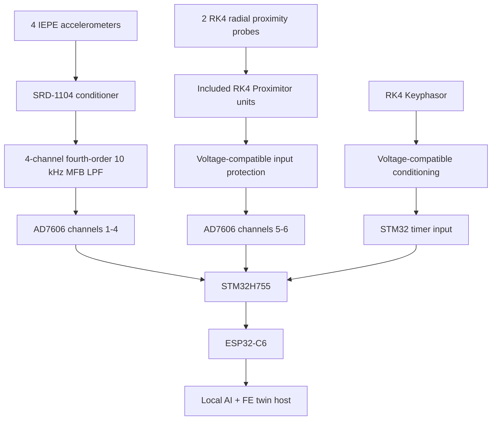
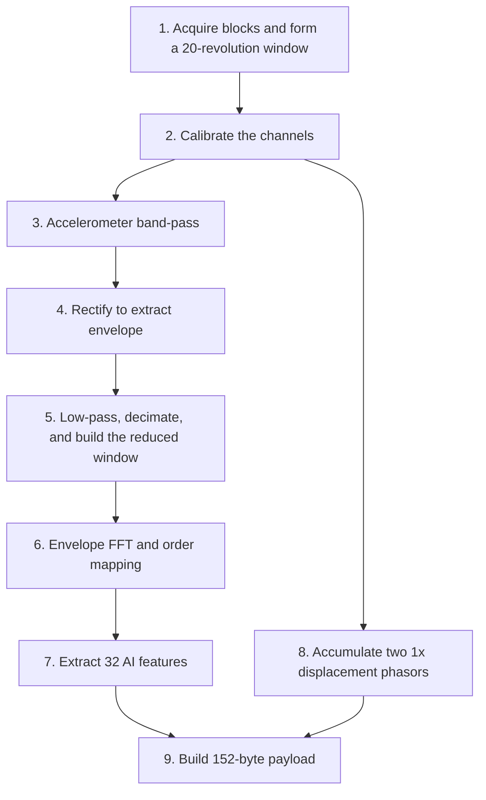

# Real-Time Edge AI Bearing Monitoring System
## COE Edge Acquisition and Processing Node

### 1. Purpose and Scope

The system monitors a Bently Nevada RK4 rotor kit in two steady operating modes: **1750 RPM** and **3600 RPM**. Each accepted 20-revolution window is collected only after the selected speed has settled. The system has three layers:

1. **Mechanical layer:** The rotor kit, bearings, accelerometers, proximity probes, and Keyphasor generate the measurements.
2. **COE edge layer:** The AD7606 and STM32 collect the measurements, process each 20-revolution window, and send a fixed payload through the ESP32-C6.
3. **ICS layer:** A local host runs the AI model, FE digital twin, and 2D dashboard.

The COE layer receives:

- Four accelerometer channels for bearing-fault features.
- Two radial proximity channels for shaft displacement, one at each measurement plane.
- One Keyphasor pulse per revolution for RPM, window boundaries, and phase reference.

The digital twin is the FE beam model. An interactive 3D model is not part of this design.

---

### 2. Specification Mapping

The numbering follows the submitted specification sheet.

| Requirement | How the Design Addresses It | Current Evidence |
| :--- | :--- | :--- |
| **Specification 4** — Sample at least 25 kSamples/s per channel. | The AD7606 operates with oversampling disabled and produces all eight channel words at 30 kSample-sets/s; six channels carry active signals and two are reserved. | Datasheet timing calculated; bench test pending. |
| **Specification 5** — After a 20-revolution window is collected, make the payload ready within 333 ms, excluding the first window. | Timing starts at the final Keyphasor edge of the window and ends when the STM32 has completed the 152-byte payload in memory. | Test definition complete; STM32 timing measurement pending. |
| **Specification 6** — Produce an AI-ready representation with fixed size and ordering at both supported operating modes. | Every valid 1750 or 3600 RPM window produces the same 32 AI features, four displacement values, RPM, and timestamp in a fixed 152-byte payload. | Interface defined; integration test pending. |
| **Constraint 4** — Perform acquisition and processing locally without cloud computation. | The STM32 performs acquisition and DSP, the ESP32-C6 transports the payload, and the AI and FE twin run on a local host. | Architecture defined; offline integration test pending. |

The document uses **calculated**, **defined**, or **test pending** until the hardware has been measured. It does not claim that an untested requirement is fully met.

---

### 3. Hardware Architecture

#### 3.1 Sensor Conditioning

The four IEPE accelerometers connect through the SRD-1104 for sensor power and conditioning, then pass through the custom four-channel fourth-order MFB low-pass filter before reaching AD7606 channels V1–V4. The external filter has an approximately 10 kHz cutoff and is the primary analog anti-aliasing stage for the accelerometer channels. The AD7606's built-in second-order analog input filter remains supplemental; digital oversampling is disabled.

The two radial proximity probes use the Proximitor units included with the RK4 kit. They do not connect through the SRD-1104. Before connecting them to the AD7606, their output range, grounding, and connector mapping must be checked on the physical kit. Additional Proximitor units should not be purchased unless the kit inventory shows that they are missing.

The Keyphasor connects to an STM32 timer-capture input through a simple voltage-compatible conditioning circuit. It does not use an AD7606 analog channel.

#### 3.2 ADC Channel Assignment

| AD7606 Channel | Signal | Purpose |
| :---: | :--- | :--- |
| V1 | Accelerometer — Plane 1 X | AI vibration features |
| V2 | Accelerometer — Plane 1 Y | AI vibration features |
| V3 | Accelerometer — Plane 2 X | AI vibration features |
| V4 | Accelerometer — Plane 2 Y | AI vibration features |
| V5 | Proximity — Plane 1 radial direction | FE shaft displacement |
| V6 | Proximity — Plane 2 radial direction | FE shaft displacement |
| V7 | Unused/reserved | Fixed ADC transfer format |
| V8 | Unused/reserved | Fixed ADC transfer format |

The physical RK4 connectors must be inspected before wiring to confirm this planned assignment.

#### 3.3 Sampling and Anti-Alias Filter

The selected sampling rate is **30 kSample-sets/s**, with `OS[2:0] = 000` disabling AD7606 digital oversampling. The STM32 generates one `CONVST` event every 33.333 microseconds. Each event produces one simultaneous 16-bit result for every channel, so the STM32 receives 30 kSample-sets/s directly.

The custom fourth-order MFB low-pass filter is installed between the SRD-1104 and AD7606 channels V1–V4. Its approximately 10 kHz cutoff is below the 15 kHz Nyquist frequency produced by the 30 kSample/s rate. The AD7606's built-in second-order analog input filter remains active as supplemental filtering, but its optional digital oversampling filter is not used.

Commissioning must measure the complete SRD-1104 → external LPF → AD7606 response, confirm that the required 2–8 kHz bearing-resonance band is preserved, and verify the attenuation above the intended passband. The detailed component calculations and circuit are maintained in [LPF Design Details](LPF-design-details-circuit.md).

---

### 4. Acquisition, Windowing, and Memory

#### 4.1 Sampling Timing

At 30 kSamples/s:

> Sample period = 1 divided by 30,000 = **33.333 microseconds**

One simultaneous sample set contains eight 16-bit values:

> 8 channels x 16 bits = **128 bits**

With an initial 10 MHz serial clock setting, transferring those 128 bits takes approximately:

> 128 bits divided by 10,000,000 bits/s = **12.8 microseconds**

With oversampling disabled, the AD7606 conversion time is at most 4.2 microseconds. A `BUSY` falling-edge event indicates that the new result is available and starts the 10 MHz SPI/DMA read. The 128-bit read takes approximately 12.8 microseconds, so conversion plus transfer requires at most approximately 17.0 microseconds. This leaves approximately 16.3 microseconds before the next `CONVST` event at the selected 30 kHz sampling rate.

The completed result must be read before the following `BUSY` falling edge updates the output register. Successive results are 33.333 microseconds apart, while the SPI transfer takes 12.8 microseconds, leaving approximately 20.5 microseconds for interrupt/DMA-start latency and margin after each `BUSY` falling edge. The transfer must not occur exactly on a `BUSY` falling edge.

#### 4.2 Twenty-Revolution Window

A window starts at one Keyphasor edge and ends after 20 complete revolutions. Therefore, 21 Keyphasor edges define one window: one starting edge and 20 ending boundaries.

> Window duration in seconds = (20 x 60) divided by RPM

| Shaft Speed | Window Duration | Approximate samples per channel at 30 kSamples/s |
| :---: | :---: | :---: |
| 1750 RPM | 685.7 ms | 20,571 |
| 3600 RPM | 333.3 ms | 10,000 |

Average RPM is calculated from the measured complete-window duration:

> Average RPM = 1,200 divided by measured window duration in seconds

The value 1,200 equals 20 revolutions x 60 seconds/minute. Windows that include startup, shutdown, or a transition between the two modes are excluded from the baseline output.

The 333 ms requirement is a **processing** requirement. Its timer starts only after the 20-revolution window has finished.

#### 4.3 Memory Approach

At 1750 RPM, storing all eight ADC words for one complete raw window would require approximately:

> 20,571 sample sets x 8 channel words x 2 bytes = **329,136 bytes**

This large raw buffer is unnecessary because the streaming operations can be completed as DMA blocks arrive. Only the reduced envelope records, running statistics, and the current revolution of proximity data need to be retained.

The baseline design uses **256 simultaneous sample sets per DMA block**. One sample set contains the eight channel values captured at the same instant.

| Meaning of the Selected Size | Value |
| :--- | :---: |
| Sample sets in one block | 256 |
| Channel values in one block | 256 x 8 = 2,048 |
| Memory used by one block | 256 x 8 x 2 bytes = 4,096 bytes |
| Memory used by two alternating blocks | 8,192 bytes |
| Time to fill one block at 30 kSamples/s | 256 divided by 30,000 = 8.533 ms |

DMA fills one 4,096-byte block while the processor handles the other block. To avoid a growing backlog, the processor must sustain the streaming work for one block every 8.533 ms. That work covers all active channels together; the budget is not divided by six or eight. It includes calibration, accelerometer filtering and envelope processing, updating the running statistics, and retaining the proximity samples needed for the current revolution.

The complete 20-revolution pipeline does **not** have to finish within 8.533 ms. The FFT, order mapping, final feature extraction, displacement finalization, and construction of the 152-byte payload are completed at the end of the window and are covered by the separate 333 ms processing requirement.

The two DMA blocks use only 8 KB of RAM, so complete raw windows are not stored. During implementation, the measured block-processing time and DMA-overrun counter will be checked. The 256-sample-set size will be changed only if testing shows that it is necessary.

The detailed block-by-block timeline, firmware mental model, and complete worked example are provided in [COE Processing Pipeline Component Details](COE_Processing_Pipeline_Component_Details%282%29.md). They are not repeated here.

---

### 5. Processing Pipeline

The processing sequence below contains the operations needed for the AI features and FE displacement input. The logical stage order, component interfaces, feature order, and payload are defined. The nine logical components, their block/window behaviour, and their simple firmware grouping are explained in [COE Processing Pipeline Component Details](COE_Processing_Pipeline_Component_Details%282%29.md). This section keeps only the architecture-level summary.

#### 5.1 Accelerometer Branch

1. The calibrated accelerometer signal is band-pass filtered using an initial 2–8 kHz bearing-sensitive resonance band.
2. Full-wave rectification folds the negative halves of the resonance waveform upward. The rectified result still contains fast ripple; it is not yet the smooth envelope.
3. A low-pass filter removes that fast ripple and recovers the slower amplitude envelope before decimation from 30 kSamples/s to the selected 5 kSamples/s envelope rate. Filtering must occur before decimation to prevent aliasing at the reduced rate.
4. After the 20-revolution window ends, the actual time-sampled envelope record is mean-removed, Hann-windowed, and zero-padded to 4096 values.
5. A 4096-point FFT produces the envelope frequency spectrum. Each frequency bin is mapped to shaft order using `order = frequency / (measured RPM / 60)`.
6. Eight features are extracted from each of the four accelerometer channels, producing 32 features.

Steps 1–3 operate as DMA blocks arrive. Steps 4–6 use the completed reduced 20-revolution window. Because every accepted record covers exactly 20 revolutions, its physical order resolution is 1/20 = 0.05 order. Zero-padding gives a convenient fixed FFT size and a denser displayed grid; it does not improve the physical resolution.

Angular resampling is not part of the baseline design because each accepted window is collected at one settled speed. Supporting both 1750 and 3600 RPM does not by itself require resampling: the measured RPM maps hertz to order separately for every window. If later Keyphasor measurements show meaningful speed variation inside a window and the spectra show smeared rotation-related peaks or unstable band features, computed order tracking must be added between the envelope and FFT stages.

The 2–8 kHz resonance band is a starting value for the installed assembly, not a universal value for every 6200 bearing. It can be changed later without changing the pipeline structure if measured vibration or a kurtogram identifies a stronger impact-sensitive band.

#### 5.2 Eight Features per Accelerometer Channel

| Local Index | Feature | Purpose |
| :---: | :--- | :--- |
| 0 | Band-pass acceleration RMS | Overall vibration level |
| 1 | Band-pass acceleration kurtosis | Vibration impulsiveness |
| 2 | Band-pass acceleration crest factor | Strong impacts relative to RMS |
| 3 | Smooth-envelope RMS | Overall bearing-impact modulation |
| 4 | FTF-family magnitude | Cage-related evidence |
| 5 | BSF-family magnitude | Rolling-element-related evidence |
| 6 | BPFO-family magnitude | Outer-race-related evidence |
| 7 | BPFI-family magnitude | Inner-race-related evidence |

The payload orders the features by accelerometer channel:

- Features 0–7: accelerometer 1.
- Features 8–15: accelerometer 2.
- Features 16–23: accelerometer 3.
- Features 24–31: accelerometer 4.

The baseline uses the bearing orders supplied by the mechanical team:

| Family | Configured order | At 1750 RPM | At 3600 RPM |
| :--- | :---: | :---: | :---: |
| FTF | 0.38 | 11.1 Hz | 22.8 Hz |
| BSF | 1.98 | 57.8 Hz | 118.8 Hz |
| BPFO | 3.05 | 89.0 Hz | 183.0 Hz |
| BPFI | 4.95 | 144.4 Hz | 297.0 Hz |

For every window, the target frequency is calculated as `configured order x measured RPM / 60`. The prototype initially combines FFT magnitudes within ±0.10 order of each fundamental. Harmonics or sidebands are added only if measured data shows that they improve classification.

#### 5.3 Proximity-Displacement Branch

The two calibrated proximity signals are processed separately. After each revolution ends, the STM32 uses the Keyphasor boundaries to update a running 1x calculation. After all 20 revolutions, it finalizes the amplitude and phase from:

- Plane 1 radial probe.
- Plane 2 radial probe.

Each channel produces two Float32 values:

- Peak amplitude in micrometres.
- Phase in radians relative to the Keyphasor.

This produces four displacement values. The raw proximity waveforms are not transmitted. The local FE host uses the two amplitude/phase pairs as its measured shaft-displacement input. With one probe per plane, the system does not measure a complete X/Y orbit or two independent radial directions at either plane.

---

### 6. Simple Fixed Payload and Communication

For every valid 20-revolution window, the STM32 creates one fixed **152-byte payload**.

| Byte Offset | Type | Field | Consumer |
| :---: | :--- | :--- | :--- |
| 0–3 | Float32 | Average RPM over the window | AI, FE twin, and dashboard |
| 4–131 | Float32[32] | Ordered accelerometer features | AI model |
| 132–135 | Float32 | Plane 1 radial, 1x peak amplitude in micrometres | FE twin |
| 136–139 | Float32 | Plane 1 radial, 1x phase in radians | FE twin |
| 140–143 | Float32 | Plane 2 radial, 1x peak amplitude in micrometres | FE twin |
| 144–147 | Float32 | Plane 2 radial, 1x phase in radians | FE twin |
| 148–151 | UInt32 | Window-end time in milliseconds since startup | Logging and sequencing |

Payload size:

> 4 bytes RPM + 128 bytes features + 16 bytes displacement + 4 bytes timestamp = **152 bytes**

Only the following rules are required:

- The field order in the table is fixed in the STM32 and host decoder.
- Float32 and UInt32 values are sent in little-endian order.
- If acquisition or processing of a window fails, the STM32 skips that window instead of sending false values.
- Feature definitions and order are documented in Section 5; they do not need to be transmitted in every payload.

The data path is intentionally simple:

The ESP32-C6 does not recalculate the features or displacement. It forwards the same payload. A small UART start marker may be added before the payload if needed to find message boundaries, but it is not part of the 152-byte application payload. More elaborate transport and diagnostic fields are outside the scope of this prototype.

---

### 7. Processing Locations

#### 7.1 STM32H755

The STM32 performs:

- AD7606 sampling and DMA input.
- Keyphasor timing and 20-revolution windowing.
- Calibration and the accelerometer DSP pipeline.
- Synchronous 1x displacement extraction.
- Construction of the 152-byte payload.

For the prototype, the Cortex-M7 performs the complete STM32 acquisition and processing workload. The Cortex-M4 is not required. It will be used only if measured timing later shows a clear need.

#### 7.2 ESP32-C6

The ESP32-C6 receives the 152-byte payload over UART and forwards it over the local Wi-Fi network. It performs no vibration or FE calculations.

#### 7.3 Local Host

The local host runs:

- The AI fault-classification and RUL model.
- The FE beam model that estimates bearing stiffness from the displacement measurements.
- The 2D dashboard for RPM, bearing condition, AI RUL, physics RUL, residual, and stiffness.

No cloud connection is required.

---

### 8. COE Layer Specification Verification

The following tests are sufficient to demonstrate whether the prototype meets the submitted COE requirements.

| Requirement | Verification Test | Pass Condition | Present Status |
| :--- | :--- | :--- | :--- |
| **Specification 4** | With oversampling disabled, record the sample count and elapsed time for every channel, verify each 10 MHz SPI/DMA read completes before the following `BUSY` falling edge, and check for DMA overruns. | Every active channel produces 30 kSamples/s, one block of streaming work completes every 8.533 ms on average, and no samples are lost. | Datasheet timing calculated; hardware test pending. |
| **Specification 5** | Measure from the final Keyphasor edge of a window until the 152-byte payload is complete in STM32 memory. Test repeated windows at 1750 and 3600 RPM. | Every tested window after the excluded first window is ready within 333 ms. | Test method defined; firmware timing pending. |
| **Specification 6** | Generate and decode payloads at the two supported modes, 1750 and 3600 RPM. | Every valid window contains exactly 152 bytes with the same field and feature ordering. | Interface defined; integration test pending. |
| **Constraint 4** | Disconnect external internet access while keeping the STM32, ESP32-C6, and host on the local network. | Acquisition, transmission, AI inference, FE processing, and dashboard display continue locally. | Architecture defined; offline test pending. |

The evidence to keep for the final report is:

1. Sample-rate and DMA-overrun logs.
2. A table of measured processing times.
3. Several decoded 152-byte payloads from both RPM modes.
4. A record of the system operating without internet access.

Until a test is performed, its status remains **calculated** or **pending**, not **fully met**.

---

### 9. Remaining Decisions

No additional answer from the mechanical team is required before implementing the baseline pipeline. The following installed-system checks remain part of implementation and commissioning:

1. Enter the measured sensitivity and offset for each installed accelerometer and proximity channel.
2. Set `OS[2:0] = 000`, verify the complete external-LPF-plus-AD7606 analog response over 2–8 kHz, and confirm the electrical compatibility of the six active inputs.
3. Verify reliable Keyphasor edge capture at both 1750 and 3600 RPM.
4. Start with the selected 2–8 kHz resonance band and 5 kSamples/s envelope rate. Refine the resonance band or envelope low-pass cutoff only if measured data identifies a better setting.
5. Monitor the Keyphasor revolution periods. Add angular resampling only if meaningful within-window speed variation produces spectral smearing or unstable order-band features.
6. Verify reliable 30 kSample-sets/s acquisition with oversampling disabled, 10 MHz SPI/DMA reads triggered after `BUSY` falls, and one processed 256-sample-set block every 8.533 ms without overruns.
7. Implement the UART and local Wi-Fi transfer and confirm that the host decodes the 152-byte payload.

These checks tune or verify the installed system; they do not leave the architecture undefined.

---

## Bill of Materials

| Component | Role | Source / Status |
|---|---|---|
| STM32 NUCLEO-H755ZI-Q | Acquisition, timing, and DSP controller | [Amazon](https://www.amazon.sa/-/en/XFCZMG-NUCLEO-H755ZI-Q-Nucleo-144-Development-STM32H755ZI/dp/B0CKVZ2X7Z) |
| A49T AD7606 eight-channel ADC module | Simultaneously samples six conditioned analog signals; two ADC channels remain reserved | [AliExpress](https://www.aliexpress.com/item/1005012637207490.html) — verify the received module, input-range configuration, and serial timing |
| SMACQ SRD-1104 | Powers and conditions four IEPE accelerometers | [AliExpress](https://ar.aliexpress.com/item/1005007510744310.html) |
| Four-channel fourth-order MFB low-pass filter | Provides an approximately 10 kHz analog anti-alias filter between the SRD-1104 and AD7606 | Custom circuit using two TL074 ICs and the resistor/capacitor kits listed below |
| AD7606 on-chip filtering | Provides supplemental second-order analog filtering after the external LPF | Built into the selected ADC; digital oversampling is disabled in the baseline design |
| TL074CN DIP-14 quad op-amps | Implements eight second-order MFB stages: two stages for each of four accelerometer channels | [AliExpress](https://ar.aliexpress.com/item/1005006131796020.html) — two ICs required; one 10-piece package selected |
| DIP-14 IC sockets | Allows the two TL074 ICs to be installed and replaced without desoldering | [AliExpress](https://ar.aliexpress.com/item/1005006130784050.html) — two sockets required; one package selected |
| 1% metal-film resistor assortment | Supplies the 20 kΩ, 10 kΩ, and 3.3 kΩ resistors required by the LPF | [AliExpress](https://ar.aliexpress.com/item/1005008289034002.html) |
| Ceramic capacitor assortment | Supplies the 1 nF, 200 pF, 47 pF, 300 pF, 4.7 nF, and 100 nF capacitors required by the LPF | [AliExpress](https://ar.aliexpress.com/item/1005009570762979.html) |
| Electrolytic capacitor assortment | Supplies bulk decoupling capacitors for the LPF power rails | [AliExpress](https://ar.aliexpress.com/item/1005008123014567.html) |
| 24 V → 5 V DC-DC buck converter | Generates the regulated 5 V bus for the AD7606, STM32, and ESP32-C6 | [AliExpress](https://ar.aliexpress.com/item/1005008965910286.html) — 3 A/15 W converter retained |
| A2415S-1WR3 isolated DC-DC converter | Converts the 24 V supply into approximately +15 V, COM, and −15 V for the two TL074 ICs | [AliExpress](https://ar.aliexpress.com/item/1005006169352485.html) — one module selected; verify both output rails before installing the TL074s |
| Universal double-sided perfboard | Holds the final soldered LPF and its power/interface connections | [AliExpress](https://ar.aliexpress.com/item/1005003647800709.html) |
| 2-pin and 3-pin PCB terminal blocks | Provides removable signal, power, ground, and ±15 V connections on the LPF board | [AliExpress](https://ar.aliexpress.com/item/1005007055503766.html) |
| UL1007 22-AWG multicolor hookup wire | Connects power, ground, and signals within the acquisition node | [AliExpress](https://ar.aliexpress.com/item/1005005450270866.html) |
| SRD-1104 rear terminal connection | Connects the four SRD-1104 signal outputs to the four LPF inputs | Uses the 10-pin, 3.81 mm terminal supplied with the SRD-1104; BNC pigtails are not required |
| ESP32-C6 development board | UART-to-local-Wi-Fi communication bridge | [AliExpress](https://www.aliexpress.com/item/1005012742424741.html) |
| Analog signal cabling | Connects the SRD-1104 outputs to the LPF and the LPF outputs to the AD7606 | **Pending** — cable type and length will be selected after receiving the components and measuring the final installation distances |
| Four IEPE accelerometers | Measures vibration at the selected machine locations | **Pending** — accelerometer models have not yet been selected |
| Coaxial cables, sensor to conditioner | Connects each accelerometer to an SRD-1104 BNC input | **Pending** — sensor-end connector depends on the selected accelerometer; commonly 10-32 to BNC |
| Proximitor-to-ADC connection/protection | Connects the two RK4 buffered displacement outputs safely to the AD7606 | **Pending** — requires measuring the actual Proximitor output-voltage range |
| Keyphasor input conditioning | Protects the STM32 input and produces a valid timer-capture signal | **Pending** — requires measuring the actual RK4 Keyphasor output-voltage level |
| 24 V source interface hardware | Physically connects the acquisition node to the local control system’s 24 V supply | **Pending** — connector type must be confirmed with the mechanical engineer |
---

## References

1. [COE Processing Pipeline Component Details](COE_Processing_Pipeline_Component_Details%282%29.md) — explanation of all nine logical processing components, the streaming method, firmware mental model, and worked example.
2. Bently Nevada, *RK4 Rotor Kit Datasheet*, document 141592, Rev. K.
3. SMACQ, *SRD-1104 User Manual*.
4. Analog Devices, *AD7606/AD7606-6/AD7606-4 Data Sheet*.
5. STMicroelectronics, *STM32H755ZI Product Documentation*.
6. R. B. Randall and J. Antoni, “Rolling element bearing diagnostics—A tutorial,” *Mechanical Systems and Signal Processing*, vol. 25, no. 2, pp. 485–520, 2011. [DOI: 10.1016/j.ymssp.2010.07.017](https://doi.org/10.1016/j.ymssp.2010.07.017).
