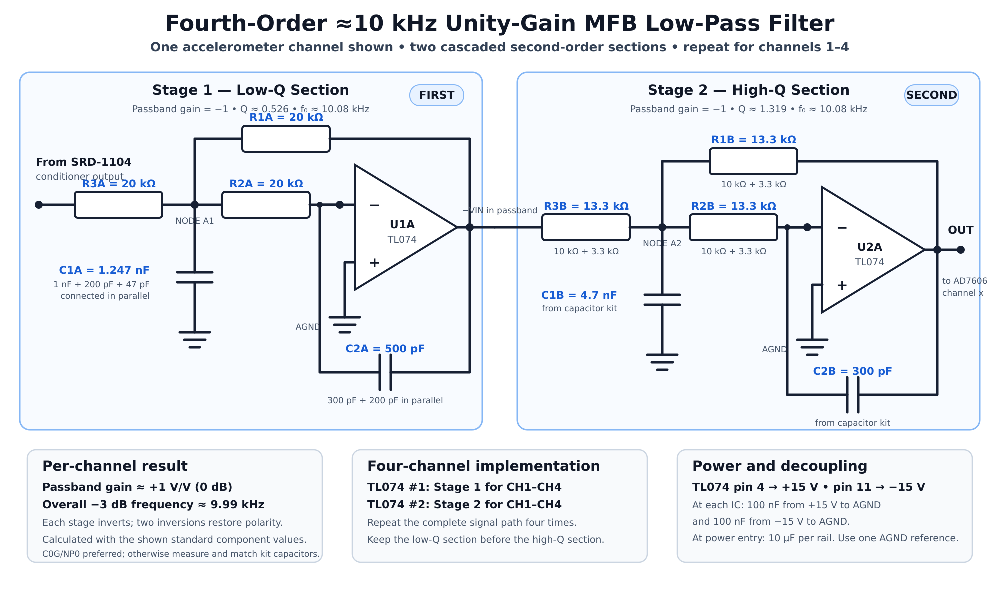

# Fourth-Order 10 kHz Unity-Gain MFB Low-Pass Filter

## Design objective

This document records the design of the analog anti-aliasing filter placed between one SRD-1104 output channel and one AD7606 analog input. The complete implementation repeats the same filter for four accelerometer channels.

| Parameter | Requirement |
|---|---:|
| Filter response | Butterworth low-pass |
| Filter order | Fourth order |
| Cutoff frequency, $f_c$ | 10 kHz |
| Passband gain | Unity, $1\ \mathrm{V/V}$ |
| Input and output | Bipolar, single-ended |
| Op-amp supply | $+15\ \mathrm{V}$, AGND, $-15\ \mathrm{V}$ |
| Implementation | Two cascaded second-order MFB stages |

## Complete circuit

The low-$Q$ section is connected first, followed by the high-$Q$ section. Each section has a gain of $-1$, so the two inversions restore the original polarity and give an overall passband gain of $+1$.

## 1. Calculate the cutoff angular frequency

The selected cutoff frequency is:

$$
f_c=10{,}000\ \mathrm{Hz}
$$

Therefore:

$$
\omega_c=2\pi f_c
$$

$$
\boxed{\omega_c=2\pi(10{,}000)=62{,}831.85\ \mathrm{rad/s}}
$$

## 2. Divide the fourth-order Butterworth response into two stages

The normalized fourth-order Butterworth denominator is:

$$
s^4+2.6131s^3+3.4142s^2+2.6131s+1
$$

It factors into two second-order sections:

$$
(s^2+1.84776s+1)(s^2+0.76537s+1)
$$

The standard second-order denominator is:

$$
s^2+\frac{\omega_0}{Q}s+\omega_0^2
$$

Consequently, the two required quality factors are:

$$
Q_1=\frac{1}{1.84776}=\boxed{0.5412}
$$

$$
Q_2=\frac{1}{0.76537}=\boxed{1.3066}
$$

Both stages are designed with a natural frequency of approximately 10 kHz.

| Stage | Natural frequency, $f_0$ | Required $Q$ | Position |
|---|---:|---:|---|
| Stage 1 | 10 kHz | 0.5412 | First, low-$Q$ section |
| Stage 2 | 10 kHz | 1.3066 | Second, high-$Q$ section |

The low-$Q$ stage is placed first to reduce internal signal peaking and the possibility of op-amp saturation.

## 3. MFB stage transfer function

For each multiple-feedback stage:

- $R_3$ is the input resistor.
- $R_1$ connects the output to the summing node.
- $R_2$ connects the summing node to the inverting input.
- $C_1$ connects the summing node to AGND.
- $C_2$ connects the output to the inverting input.
- The non-inverting op-amp input is connected to AGND.

The transfer function is:

$$
H(s)=
-\frac{\dfrac{1}{R_2R_3C_1C_2}}
{s^2+s\left[\frac{1}{C_1}\left(\frac{1}{R_1}+\frac{1}{R_2}+\frac{1}{R_3}\right)\right]+\dfrac{1}{R_1R_2C_1C_2}}
$$

The DC gain is:

$$
K=-\frac{R_1}{R_3}
$$

To obtain unity-magnitude gain, select:

$$
R_1=R_3
$$

The design is simplified further by making all three resistors in each section equal:

$$
\boxed{R_1=R_2=R_3=R}
$$

This gives:

$$
\boxed{K=-1}
$$

For two cascaded sections:

$$
K_{\mathrm{total}}=(-1)(-1)=\boxed{+1}
$$

## 4. Equal-resistor component equations

When $R_1=R_2=R_3=R$:

$$
\omega_0=\frac{1}{R\sqrt{C_1C_2}}
$$

and:

$$
Q=\frac{1}{3}\sqrt{\frac{C_1}{C_2}}
$$

Solving these equations for the two capacitors gives:

$$
\boxed{C_1=\frac{3Q}{R\omega_0}}
$$

$$
\boxed{C_2=\frac{1}{3QR\omega_0}}
$$

These equations are applied independently to the low-$Q$ and high-$Q$ sections.

---

## 5. Stage 1: low-$Q$ section

### Stage 1 requirements

$$
Q_1=0.5412
$$

$$
\omega_0=62{,}831.85\ \mathrm{rad/s}
$$

A moderate resistor value is chosen to avoid heavily loading the SRD-1104 output:

$$
\boxed{R_{1A}=R_{2A}=R_{3A}=20\ \mathrm{k\Omega}}
$$

### Calculate the ideal capacitor values

$$
C_{1A}=\frac{3(0.5412)}{(20{,}000)(62{,}831.85)}
$$

$$
\boxed{C_{1A,\mathrm{ideal}}=1.292\ \mathrm{nF}}
$$

$$
C_{2A}=\frac{1}{3(0.5412)(20{,}000)(62{,}831.85)}
$$

$$
\boxed{C_{2A,\mathrm{ideal}}=490.1\ \mathrm{pF}}
$$

The selected practical values are:

$$
\boxed{C_{1A}=1.247\ \mathrm{nF}}
$$

$$
\boxed{C_{2A}=500\ \mathrm{pF}}
$$

### Verify Stage 1

$$
f_{0A}=\frac{1}{2\pi(20{,}000)\sqrt{(1.247\ \mathrm{nF})(500\ \mathrm{pF})}}
$$

$$
\boxed{f_{0A}=10.078\ \mathrm{kHz}}
$$

$$
Q_A=\frac{1}{3}\sqrt{\frac{1.247\ \mathrm{nF}}{500\ \mathrm{pF}}}
$$

$$
\boxed{Q_A=0.5264}
$$

$$
K_A=-\frac{R_{1A}}{R_{3A}}=-\frac{20\ \mathrm{k\Omega}}{20\ \mathrm{k\Omega}}=\boxed{-1}
$$

---

## 6. Stage 2: high-$Q$ section

### Stage 2 requirements

$$
Q_2=1.3066
$$

$$
\omega_0=62{,}831.85\ \mathrm{rad/s}
$$

The selected resistor value is:

$$
\boxed{R_{1B}=R_{2B}=R_{3B}=13.3\ \mathrm{k\Omega}}
$$

### Calculate the ideal capacitor values

$$
C_{1B}=\frac{3(1.3066)}{(13{,}300)(62{,}831.85)}
$$

$$
\boxed{C_{1B,\mathrm{ideal}}=4.691\ \mathrm{nF}}
$$

$$
C_{2B}=\frac{1}{3(1.3066)(13{,}300)(62{,}831.85)}
$$

$$
\boxed{C_{2B,\mathrm{ideal}}=305.3\ \mathrm{pF}}
$$

The selected practical values are:

$$
\boxed{C_{1B}=4.7\ \mathrm{nF}}
$$

$$
\boxed{C_{2B}=300\ \mathrm{pF}}
$$

### Verify Stage 2

$$
f_{0B}=\frac{1}{2\pi(13{,}300)\sqrt{(4.7\ \mathrm{nF})(300\ \mathrm{pF})}}
$$

$$
\boxed{f_{0B}=10.078\ \mathrm{kHz}}
$$

$$
Q_B=\frac{1}{3}\sqrt{\frac{4.7\ \mathrm{nF}}{300\ \mathrm{pF}}}
$$

$$
\boxed{Q_B=1.3194}
$$

$$
K_B=-\frac{R_{1B}}{R_{3B}}=-\frac{13.3\ \mathrm{k\Omega}}{13.3\ \mathrm{k\Omega}}=\boxed{-1}
$$

## 7. Complete filter verification

The two stage gains multiply:

$$
K_{\mathrm{total}}=K_AK_B=(-1)(-1)=\boxed{+1}
$$

Using the selected practical component values, the calculated complete filter has:

$$
\boxed{f_{-3\mathrm{dB}}\approx9.986\ \mathrm{kHz}}
$$

This is approximately $0.14\%$ below the 10 kHz target.

| Frequency | Calculated filter gain |
|---:|---:|
| 1 kHz | -0.008 dB |
| 5 kHz | -0.144 dB |
| 9 kHz | -1.63 dB |
| 10 kHz | -3.03 dB |
| 15 kHz | -14.16 dB |
| 20 kHz | -23.96 dB |
| 25 kHz | -31.67 dB |

## 8. Final component values per channel

| Component | Stage 1: low $Q$ | Stage 2: high $Q$ |
|---|---:|---:|
| $R_1$ | 20 kΩ | 13.3 kΩ |
| $R_2$ | 20 kΩ | 13.3 kΩ |
| $R_3$ | 20 kΩ | 13.3 kΩ |
| $C_1$ | 1.247 nF | 4.7 nF |
| $C_2$ | 500 pF | 300 pF |
| Stage gain | -1 | -1 |
| Calculated $f_0$ | 10.078 kHz | 10.078 kHz |
| Calculated $Q$ | 0.5264 | 1.3194 |

## 9. Four-channel implementation

- TL074 number 1 implements Stage 1 for channels 1-4.
- TL074 number 2 implements Stage 2 for channels 1-4.
- Each TL074 uses pin 4 for $+15\ \mathrm{V}$ and pin 11 for $-15\ \mathrm{V}$.
- Place one 100 nF ceramic capacitor from each supply rail to AGND at each TL074.
- Add a 10 µF bulk capacitor from each supply rail to AGND at the filter-board power entry.
- Keep the low-$Q$ section before the high-$Q$ section in every channel.

## 10. Component-combination notes

The non-standard practical values can be assembled from the available component assortments:

$$
1.247\ \mathrm{nF}=1\ \mathrm{nF}+200\ \mathrm{pF}+47\ \mathrm{pF}
$$

$$
500\ \mathrm{pF}=300\ \mathrm{pF}+200\ \mathrm{pF}
$$

The capacitors in these expressions are connected in parallel.

$$
13.3\ \mathrm{k\Omega}=10\ \mathrm{k\Omega}+3.3\ \mathrm{k\Omega}
$$

The resistors are connected in series.

For the final implementation, C0G/NP0 capacitors are preferred. If general-purpose assortment capacitors are used, measure and match the values among the four channels as closely as possible.

## 11. Validation before hardware freeze

1. Simulate the complete two-stage circuit using a TL074 model.
2. Confirm the passband gain, -3 dB frequency and attenuation above 10 kHz.
3. Build and test one channel first.
4. Apply a swept sine wave using a function generator.
5. Measure the response after Stage 1 and after Stage 2.
6. Repeat the circuit for the remaining three channels only after the first channel passes testing.

## Reference

- Texas Instruments, [Design Methodology for MFB Filters](https://www.ti.com/lit/an/sboa231/sboa231.pdf).

