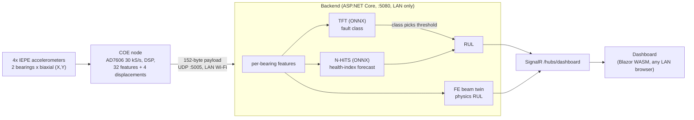

# Real-Time Edge Digital Twin for Bearing Fault Diagnosis and RUL Prediction in OH-2 Centrifugal Pumps

KFUPM Senior Design II (ICS414), Team M001 (COE, ICS, ME). A sensor node near the pump streams 152-byte
feature payloads over the LAN to a backend that classifies the bearing fault, estimates remaining useful life
(RUL), runs a finite-element beam twin, and pushes the result to a web dashboard.

Status in one line: the pipeline runs end to end on public data and on a simulation; there is **no data from the
team rig yet**, and several accuracy specs currently FAIL (see [Honest status](#honest-status)).

## Architecture



Without a node, the backend replays a payload stream (`demo`: held-out XJTU-SY public data; `twin-sim`:
synthetic; `synthetic`). Details: [`INTEGRATION.md`](INTEGRATION.md), [`src/DigitalTwin.Backend/README.md`](src/DigitalTwin.Backend/README.md).

## Quick start

### Docker (needs Docker only)

```bash
docker compose build backend
docker compose up -d backend            # http://localhost:5080/  (dashboard + API), UDP 5005 for the node
curl http://localhost:5080/api/health   # {"status":"ok","isSimulated":false}
curl http://localhost:5080/api/state    # live snapshot from the replay
docker compose down

DT_SOURCE=twin-sim docker compose up -d backend          # demo | twin-sim | synthetic; DT_RATE_HZ=10
docker compose --profile ai run --rm ai-engine           # app.py selftest (first build downloads CPU torch)
docker compose --profile notebook up notebook            # Jupyter on http://localhost:8888/ (127.0.0.1 only)
```
C5 (LAN only): `5080:5080` publishes on every host interface. Put your LAN address in front in
`docker-compose.yml` (`"192.168.1.50:5080:5080/tcp"`, same for UDP 5005) to bind one interface. The backend also
returns 403 to non-private client addresses, but Docker Desktop NATs, so the guard then sees the Docker gateway.

### Native (.NET 10 SDK)

```powershell
./scripts/run-demo.ps1                       # publishes the dashboard once (~2 min), builds, runs the replay
./scripts/run-demo.ps1 -Mode twin-sim        # [SIMULATION] twin demo
./scripts/run-demo.ps1 -Bind 192.168.1.50    # one LAN interface
```
Linux/macOS: `./scripts/run-demo.sh [demo|twin-sim|synthetic] [rateHz] [bindAddress] [port]`.
Tests: `dotnet test DigitalTwin.slnx`.

### AI engine (Python, CPU torch)

```bash
cd AI-engine
python app.py selftest     # no model or data needed
python app.py evaluate --datasets xjtu_sy ims --run real --tag real   # held-out scoring -> reports/latest.md
python app.py demo         # 152-byte payload replay through the ONNX HybridEngine
```
Full train/select/finetune/export command list: [`AI-engine/README.md`](AI-engine/README.md). Raw datasets are
not in git (`AI-engine/data/`).

### Evidence notebook

[`AI-engine/notebooks/PPR_ICS_Evidence.ipynb`](AI-engine/notebooks/PPR_ICS_Evidence.ipynb): a scorecard that
recomputes each ICS spec claim from data on disk (PPR evidence). It also contains §1b *Datasets used* (sources, sizes on disk, windows per class, frozen splits, bearing lifetimes), §6b the per-bearing values behind the S7 MAPE, and §7b the metric definitions with per-class TP/FP/FN/TN, precision, recall and F1 behind the macro-F1.

## Repository map

| Path | Contents | Owner |
|---|---|---|
| `AI-engine/` | training, evaluation, ONNX export, `models/`, `reports/`, frozen `splits.json`; design contract in `DESIGN.md` | Jaddoua (ICS) |
| `AI-test/` | earlier synthetic-only testbench | Jaddoua |
| `src/DigitalTwin.Backend/` | ingest, features, ONNX inference, twin, SignalR, LAN guard | integration |
| `src/DigitalTwin.Dashboard/` | Blazor WASM dashboard + 3D viewer | **Mussab (ICS)**, do not edit without him |
| `tests/`, `tools/DemoMeasure/` | backend tests (golden parity, LAN-only), latency/rate client | integration |
| `docker/`, `docker-compose.yml`, `scripts/` | container and run scripts | integration |
| `Project architecture/` | specs, COE/ME/ICS design docs | team |

Branches: `feature/*` -> `dev` (integration) -> `stage` -> `main`. `feature/dashboard` is Mussab's; merge it into
ours, never commit to it. AI work lives on `feature/ai-engine`, this stack on `feature/integration`.

## The AI part

### Datasets
Decision of 2026-10-04, see [`ICS External Datasets & Literature Precedent.md`](<Project architecture/ICS/ICS External Datasets & Literature Precedent.md>) section 5.
Every dataset must survive the rig's DSP chain (2-8 kHz band-pass, 20-revolution windows, speeds 1750/3600 rpm).

| Dataset | Used for | Why |
|---|---|---|
| XJTU-SY (15 run-to-failure bearings, 25.6 kHz, 2 axes) | RUL pretraining (primary) | records are 44-51 revolutions; failed element labelled (outer, inner, cage) |
| IMS Test 1 (4 bearings, 20 kHz, 2 axes) | RUL, and the fine-tuning rehearsal | only multi-bearing biaxial run-to-failure set; held out of pretraining |
| MaFaulDa (seeded ball/cage/outer, 737-3686 rpm) | classification | speed sweep covers both rig speeds; bearing orders within 0.11 of the rig's. In the v2 results (the v1 run used XJTU-SY + IMS only). Its test records are contiguous speed blocks of the same rig, and it has no inner-race class |
| FEMTO-ST / PRONOSTIA | rejected | 0.1 s records = 2.5-3 revolutions, a 20-revolution window cannot be formed |
| CWRU | rejected / demoted | single axis per bearing; most files are 12 kHz, which cannot cover the 2-8 kHz band |

### Model unit: one biaxial bearing
Public sets have 1 test bearing (XJTU-SY) to 4 (IMS), the rig has 2, each with two orthogonal axes. So models
see **one bearing's 16 features** (8 from X, 8 from Y); the rig's 32 features are two such records. This also
gives fault localisation per bearing.

### Hybrid model and coupling
- **N-HiTS** forecasts a health index (HI); RUL = time until the forecast crosses a failure threshold.
- **TFT** classifies each window (healthy / outer / inner / ball / cage) from the last 12 windows plus the
  current one; its attention gives the interpretable part.
- **Coupling**: the TFT-predicted class selects the RUL failure threshold. Stage 1-6 comes from the fraction of
  degradation consumed; stage 1 is before a causal onset detector fires (HI > mean + 3 max(sigma, 0.01) for 12
  consecutive windows).

### Pretrain, then fine-tune
`pytorch-forecasting` ships no pretrained weights, so "pretrained" means our own training on public data;
`finetune` adapts it to a new machine. The new-machine rehearsal is IMS (fine-tune on B1-B3, test on B4). It
gave only a small gain (S7 577 % to 469 %, see results). The rig fine-tune has not been done.

### Frozen, bearing-level splits
Split by bearing (run-to-failure) or by group-and-speed block (MaFaulDa), never by window, because neighbouring
windows are near-duplicates. `AI-engine/splits.json` was frozen before any real-data training. Test bearings:
XJTU-SY 1_4 (cage), 2_5 (outer), 3_4 (inner), IMS B4. Model selection uses leave-one-bearing-out on train+val only.

### S7 metric, pre-registered
`AI-engine/DESIGN.md` section 7, written before any test result existed. MAPE is the mean over test bearings of
the mean per-window |RUL_pred - RUL_true| / RUL_true on the degradation window [onset, failure minus the last 10%
of the interval]. Bearing-averaged so long-lived bearings do not dominate. RMSE, PHM-2012 score and full-window
MAPE are reported alongside, never substituted.

### ONNX export and C# parity
TFT and N-HiTS export to ONNX (`AI-engine/models/`, contract in `model_contract.json`). The backend runs them in
process through ONNX Runtime and re-implements the feature, RUL and stage logic in C#.
`golden_vectors.json` (12 cases) is checked by `GoldenParityTests`: engineered rows, TFT tensors, class
probabilities, HI and forecasts identical to printed precision; max relative RUL diff 6.6e-16.

### Key decisions and reasons

| Decision | Reason |
|---|---|
| Per-bearing unit | matches every candidate dataset and gives per-bearing diagnosis |
| Bearing-level splits, frozen early | window-level splits leak; frozen splits stop test-set tuning |
| Causal onset detector | the same rule runs live, so training labels match runtime behaviour |
| Class selects RUL threshold | failure level differs by fault type |
| Pre-registered S7 | MAPE blows up near end of life; the window was fixed before seeing results |
| FEMTO, CWRU dropped | cannot satisfy the rig's window length and band |
| Distributed node + server, LAN only (C5) | the coach wants to monitor from an office; the handheld idea was dropped |

## Results

<!-- RESULTS:BEGIN -->
Source: `AI-engine/reports/latest.md` (run `real_v2`, 20261005T012112Z, seed 20261004), `evidence/integration_measurements_20261005.md`
and `INTEGRATION.md`. Test bearings are public-dataset bearings, never used for training or model selection (the
LOBO row is the one secondary analysis that differs, see its tag).

**Disclosure:** v2 = second look at the XJTU-SY/IMS test bearings; v2 choices made on validation only; v1 kept in `reports/`.
The v2 TFT is trained jointly on XJTU-SY + IMS + MaFaulDa; N-HiTS and the RUL calibration are unchanged from v1.
MaFaulDa test records are contiguous speed blocks of the same rig, and MaFaulDa has no inner-race class.

| Spec | Target | Value | Label | Verdict |
|---|---|---|---|---|
| S7 RUL MAPE (4 test bearings) | <= 15 % | 281.8 % (IMS B4 468.6 %, XJTU 1_4 567.2 %, 2_5 47.3 %, 3_4 44.1 %) | [MEASURED on XJTU-SY/IMS] | FAIL |
| S7 secondary, LOBO over 15 XJTU-SY bearings | <= 15 % | median 73.7 %, mean 221.7 %, 0/15 within target | [MEASURED on XJTU-SY]; secondary analysis, each bearing is held out in its own fold, so it includes test bearings in other folds' training | FAIL |
| S8 TFT latency p95, ONNX, 1 thread | < 200 ms | 11.1 ms | [MEASURED loopback, dev laptop; re-measure on the chosen server] | PASS |
| Hybrid, N-HiTS ONNX inference per window (supporting) | < 200 ms per window | p50 ~0.4, p95 0.6-0.8, max 1.1-2.5 ms across runs (notebook §4b, live) | [MEASURED loopback, dev laptop] | supporting |
| Hybrid, full per window: features + TFT + N-HiTS + RUL, Python reference engine (supporting) | < 200 ms per window | p95 15-16 ms; 99.8 % of 632 windows < 200 ms; 1 window 240-260 ms (pause outside the model calls in the notebook process). Deployed C# path incl. both models: host leg max 36-61 ms (IS1 rows) | [MEASURED loopback, dev laptop] | supporting |
| IS3a macro-F1, 5 classes | >= 0.85 | 0.581 (MaFaulDa 0.848, XJTU-SY 0.450, IMS 0.679) | [MEASURED on XJTU-SY/IMS/MaFaulDa] | FAIL |
| IS3b stage error | <= 1 | max 4 (mean 0.90; 72.1 % of windows within 1) | [MEASURED on XJTU-SY/IMS] | FAIL |
| IS3c fault caught by stage 3 | all | 1 of 4 | [MEASURED on XJTU-SY/IMS] | FAIL |
| IS1 ICS leg p95 (features+TFT+N-HiTS+RUL) | part of < 500 ms | 14.4 ms | [MEASURED loopback, dev laptop; re-measure on the chosen server] | partial (see next row) |
| IS1 host leg, UDP payload ingest to dashboard client (ONNX sessions warmed up at backend start) | < 500 ms | ONNX-active windows: p50 ~25, p95 30-31 ms, max 36-61 ms across 4 runs (the notebook recomputes it live); cold-start one-off (first payload after process start) 137-149 ms | [MEASURED loopback, dev laptop; re-measure on the chosen server] | **PARTIAL: CONDITIONAL MET**. Budget, worst observed host max: 333 (COE S5 budget, not yet measured) + 61.4 = 394.4 ms, so >= 106 ms are left for the Wi-Fi hop (unmeasured). Counted as MET once COE confirms its measured leg <= 333 ms and the Wi-Fi hop is measured |
| S9 snapshot rate at a SignalR client | >= 10 Hz | 30 Hz on replay data (901 snapshots in 30 s). Physics RUL fields are populated only in twin-sim [SIMULATION] mode. The browser render was not verified in this run | [MEASURED loopback, dev laptop; re-measure on the chosen server] | PASS (rate) |
| C# vs Python parity | tol 1e-4 | max diff 0.0; RUL rel. 6.6e-16 | [MEASURED, test output] | PASS |
| C5 LAN-only guard | non-private senders refused | HTTP: 4 public addresses 403, 5 private pass; UDP 5005: public senders dropped and counted (`udpRejectedNonLan` in `/api/metrics`) | [MEASURED, test output] | PASS |
| IS2 physics-AI residual | <= 5 % | 39 % to 447 % over the run (31 h to 4 h physics RUL vs 3-7 h AI RUL) | [SIMULATION] | FAIL |
| IMS fine-tune rehearsal (B4) | n/a | S7 577 % zero-shot, 469 % after fine-tuning | [MEASURED on IMS] | small gain, still far from target |

Timing rows are from the newer integration measurements (v2 models, 2026-10-05); the earlier v1-model numbers
(2026-10-04: S9 30.0 Hz, UDP to client p50 40.6 / p95 46.4 ms) are superseded. The notebook recomputes the live numbers at every run
(`AI-engine/notebooks/PPR_ICS_Evidence.ipynb`, sections 4 and 8).
<!-- RESULTS:END -->

## Additional items with supporting evidence (for the reviewer's judgement)

Each item below is **supporting evidence; we do not claim MET**. They are listed because our work computes something relevant to
them and the reviewer may wish to credit it toward the team total. None is upgraded to MET in the scorecard. The same table is
recomputed live in the notebook, section 11 ("Additional items with supporting evidence").

| Item | Status | What our work shows | Not shown | Rank / provenance |
|---|---|---|---|---|
| IS1 (integrated) | PARTIAL: CONDITIONAL MET | Host leg, warmed-up backend, ONNX-active: p95 30-31 / max 36-61 ms across 4 runs. 333 ms COE S5 budget + 61.4 ms (worst observed max) = 394.4 ms, >= 106 ms left for the Wi-Fi hop | COE leg is the spec budget, not measured; Wi-Fi hop not measured; cold-start one-off 137-149 ms | 9 live (host leg), 2 calculation (COE leg); [MEASURED loopback, dev laptop] + [CALCULATED] |
| S6 (COE) | SUPPORTING | The Python reference implementation of COE Components 3-7 (`aiengine/dsp.py`) gives the identical (16,) per-bearing / (32,) payload vector, in the fixed order, at 8 raw records: MaFaulDa 737 to 3686 rpm (covers 1000-3600) and XJTU-SY 2100 to 2400 rpm | STM32 firmware output; the rig's own speed range | 9 live (Python reference, not firmware); [MEASURED on public data] |
| S2 (ME) | PARTIAL | FE-twin stiffness identification error, mean 4.8 to 6.5 % at 1750 rpm (within 10 % on the mean; p95 up to 13.6 %, above 10 %) | 3600 rpm not met (mean 18.7 to 24.2 %); assumed geometry; same model generates and identifies | 6; [SIMULATION] |
| IS3 (integrated), sub-results | NOT MET overall | MaFaulDa macro-F1 0.848 (target 0.85, just below); healthy false-alarm 0.7 % of 1909 healthy windows over all test data (9.8 % of 132 on MaFaulDa); faulty windows called healthy 1.3 %; stage error within +/-1 on 72.1 % of windows | overall macro-F1 0.581; max stage error 4; caught by stage 3 in 1 of 4 | 9 live re-score / 6 stored predictions; [MEASURED on XJTU-SY / IMS / MaFaulDa] |
| IS2 (integrated) | NOT MET | Physics RUL and AI RUL are computed and shown together on the dashboard in twin-sim mode | Residual target (<= 5 %) not met: median about 100 % in simulation | 9 live (simulation); [SIMULATION] |
| S7 | NOT MET | Pipeline complete and measured: 281.8 % MAPE, independently re-scored and equal to the stored report | Target <= 15 % not met; not offered as supporting evidence | 9 live re-score / 6 stored; [MEASURED on XJTU-SY + IMS] |

## Presenter checklist

- .NET 10 SDK installed. Do a Release build and the NuGet restore beforehand, while online (`dotnet build -c Release DigitalTwin.slnx`).
- Jupyter kernel `dt-aiengine`, from `../Digital-Twin-Senior-Proj/AI-test/.venv`.
- Raw data at `../Digital-Twin-Senior-Proj/AI-engine/data`, or set `AIENGINE_DATA_DIR`.
- Ports 5080 (HTTP) and 5005 (UDP) free.
- Kernel, Restart & Run All takes about 4 minutes. `AI-engine/notebooks/PPR_ICS_Evidence.html` is the offline fallback (saved outputs).
- Do not claim IS3 from the live replay (the bearing-1 class flickers and alerts before the labelled onset).
- C4 is counted for ICS: team decision 2026-10-05 (the system uses no cloud service; AI inference and dashboard run on the local host). C4 is COE-assigned in the spec sheet; the ICS evidence covers the AI/host part.
- For the demo, bind to the LAN IP: `./scripts/run-demo.ps1 -Bind <LAN IP>`. Kestrel binds 0.0.0.0 by default; the C5 guard refuses
  non-private senders on HTTP and UDP either way.

## Honest status

- **Passing**: S8 latency, S9 snapshot rate (replay data), C# parity, LAN-only guard (HTTP and UDP). **IS1 is PARTIAL: CONDITIONAL MET**: the host leg is measured (ONNX-active p95 30-31 / max 36-61 ms across 4 runs; cold-start one-off 137-149 ms); 333 ms COE S5 budget + 61.4 ms (worst observed) = 394.4 ms leaves >= 106 ms for the unmeasured Wi-Fi hop; MET once COE confirms its measured leg and the Wi-Fi hop is measured. **C4 is counted for ICS** (team decision 2026-10-05), so ICS counts C4 + C5 (constraints) and S8 + S9 (specs): department Exemplary. All timings are measured on a dev laptop with public-data replays, not on the chosen server hardware or the rig.
- **Failing**: S7 (RUL MAPE 282 % vs 15 %), IS3 (macro-F1 0.581, stage error max 4, 1 of 4 caught by stage 3), IS2 (simulation; the
  two RULs use different failure definitions and time bases).
- **Why**: few run-to-failure bearings (15 XJTU-SY, 4 IMS), very small fault-class support (67 XJTU-SY inner-race and 406
  XJTU-SY cage training windows; ball comes only from MaFaulDa, which has no inner-race class), and pretraining data that is not the rig. On the live replay
  the bearing-1 class flickers among outer/cage/inner and alerts before the labelled onset. Do not claim IS3
  from it.
- **Not done**: no rig data, no rig fine-tune, no persisted per-machine baselines,
  rotor geometry and unbalance in the twin are assumed (ME to confirm), the 168-byte payload in the FDR deck is
  rejected until COE reconciles it with the 152-byte layout.
- **Unverified**: the dashboard in a real browser (headless Edge showed a Blazor error banner of unknown cause).
