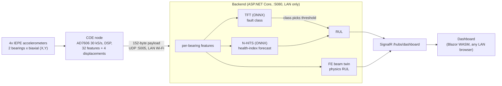

# Real-Time Edge Digital Twin for Bearing Fault Diagnosis and RUL Prediction in OH-2 Centrifugal Pumps

KFUPM Senior Design II (ICS414), Team M001 (COE, ICS, ME). A sensor node near the pump streams 152-byte
feature payloads over the LAN to a backend that classifies the bearing fault, estimates remaining useful life
(RUL), runs a finite-element beam twin, and pushes the result to a web dashboard.

Status in one line: the pipeline runs end to end on public data and on a simulation; there is **no data from the
team rig yet**, and several accuracy specs currently FAIL (see [Honest status](#honest-status)).

## Architecture



Without a node, the backend replays a payload stream (`demo`: held-out XJTU-SY public data; `twin-sim`:
synthetic; `synthetic`). Details: [`INTEGRATION.md`](INTEGRATION.md), [`src/DigitalTwin.Backend/README.md`](src/DigitalTwin.Backend/README.md).

## Quick start

### Docker (needs Docker only)

```bash
docker compose build backend
docker compose up -d backend            # http://localhost:5080/  (dashboard + API), UDP 5005 for the node
curl http://localhost:5080/api/health   # {"status":"ok","isSimulated":false}
curl http://localhost:5080/api/state    # live snapshot from the replay
docker compose down

DT_SOURCE=twin-sim docker compose up -d backend          # demo | twin-sim | synthetic; DT_RATE_HZ=10
docker compose --profile ai run --rm ai-engine           # app.py selftest (first build downloads CPU torch)
docker compose --profile notebook up notebook            # Jupyter on http://localhost:8888/ (127.0.0.1 only)
```
C5 (LAN only): `5080:5080` publishes on every host interface. Put your LAN address in front in
`docker-compose.yml` (`"192.168.1.50:5080:5080/tcp"`, same for UDP 5005) to bind one interface. The backend also
returns 403 to non-private client addresses, but Docker Desktop NATs, so the guard then sees the Docker gateway.

### Native (.NET 10 SDK)

```powershell
./scripts/run-demo.ps1                       # publishes the dashboard once (~2 min), builds, runs the replay
./scripts/run-demo.ps1 -Mode twin-sim        # [SIMULATION] twin demo
./scripts/run-demo.ps1 -Bind 192.168.1.50    # one LAN interface
```
Linux/macOS: `./scripts/run-demo.sh [demo|twin-sim|synthetic] [rateHz] [bindAddress] [port]`.
Tests: `dotnet test DigitalTwin.slnx`.

### AI engine (Python, CPU torch)

```bash
cd AI-engine
python app.py selftest     # no model or data needed
python app.py evaluate --datasets xjtu_sy ims --run real --tag real   # held-out scoring -> reports/latest.md
python app.py demo         # 152-byte payload replay through the ONNX HybridEngine
```
Full train/select/finetune/export command list: [`AI-engine/README.md`](AI-engine/README.md). Raw datasets are
not in git (`AI-engine/data/`).

### Evidence notebook

[`AI-engine/notebooks/PPR_ICS_Evidence.ipynb`](AI-engine/notebooks/PPR_ICS_Evidence.ipynb): a scorecard that
recomputes each ICS spec claim from data on disk (PPR evidence).

## Repository map

| Path | Contents | Owner |
|---|---|---|
| `AI-engine/` | training, evaluation, ONNX export, `models/`, `reports/`, frozen `splits.json`; design contract in `DESIGN.md` | Jaddoua (ICS) |
| `AI-test/` | earlier synthetic-only testbench | Jaddoua |
| `src/DigitalTwin.Backend/` | ingest, features, ONNX inference, twin, SignalR, LAN guard | integration |
| `src/DigitalTwin.Dashboard/` | Blazor WASM dashboard + 3D viewer | **Mussab (ICS)**, do not edit without him |
| `tests/`, `tools/DemoMeasure/` | backend tests (golden parity, LAN-only), latency/rate client | integration |
| `docker/`, `docker-compose.yml`, `scripts/` | container and run scripts | integration |
| `Project architecture/` | specs, COE/ME/ICS design docs | team |

Branches: `feature/*` -> `dev` (integration) -> `stage` -> `main`. `feature/dashboard` is Mussab's; merge it into
ours, never commit to it. AI work lives on `feature/ai-engine`, this stack on `feature/integration`.

## The AI part

### Datasets
Decision of 2026-10-04, see [`ICS External Datasets & Literature Precedent.md`](<Project architecture/ICS/ICS External Datasets & Literature Precedent.md>) section 5.
Every dataset must survive the rig's DSP chain (2-8 kHz band-pass, 20-revolution windows, speeds 1750/3600 rpm).

| Dataset | Used for | Why |
|---|---|---|
| XJTU-SY (15 run-to-failure bearings, 25.6 kHz, 2 axes) | RUL pretraining (primary) | records are 44-51 revolutions; failed element labelled (outer, inner, cage) |
| IMS Test 1 (4 bearings, 20 kHz, 2 axes) | RUL, and the fine-tuning rehearsal | only multi-bearing biaxial run-to-failure set; held out of pretraining |
| MaFaulDa (seeded ball/cage/outer, 737-3686 rpm) | classification (planned) | speed sweep covers both rig speeds; bearing orders within 0.11 of the rig's. **Not in the v1 results**: the real run used XJTU-SY + IMS only |
| FEMTO-ST / PRONOSTIA | rejected | 0.1 s records = 2.5-3 revolutions, a 20-revolution window cannot be formed |
| CWRU | rejected / demoted | single axis per bearing; most files are 12 kHz, which cannot cover the 2-8 kHz band |

### Model unit: one biaxial bearing
Public sets have 1 test bearing (XJTU-SY) to 4 (IMS), the rig has 2, each with two orthogonal axes. So models
see **one bearing's 16 features** (8 from X, 8 from Y); the rig's 32 features are two such records. This also
gives fault localisation per bearing.

### Hybrid model and coupling
- **N-HiTS** forecasts a health index (HI); RUL = time until the forecast crosses a failure threshold.
- **TFT** classifies each window (healthy / outer / inner / ball / cage) from the last 12 windows plus the
  current one; its attention gives the interpretable part.
- **Coupling**: the TFT-predicted class selects the RUL failure threshold. Stage 1-6 comes from the fraction of
  degradation consumed; stage 1 is before a causal onset detector fires (HI > mean + 3 max(sigma, 0.01) for 12
  consecutive windows).

### Pretrain, then fine-tune
`pytorch-forecasting` ships no pretrained weights, so "pretrained" means our own training on public data;
`finetune` adapts it to a new machine. The new-machine rehearsal is IMS (fine-tune on B1-B3, test on B4). It did
not help (see results). The rig fine-tune has not been done.

### Frozen, bearing-level splits
Split by bearing (run-to-failure) or by group-and-speed block (MaFaulDa), never by window, because neighbouring
windows are near-duplicates. `AI-engine/splits.json` was frozen before any real-data training. Test bearings:
XJTU-SY 1_4 (cage), 2_5 (outer), 3_4 (inner), IMS B4. Model selection uses leave-one-bearing-out on train+val only.

### S7 metric, pre-registered
`AI-engine/DESIGN.md` section 7, written before any test result existed. MAPE is the mean over test bearings of
the mean per-window |RUL_pred - RUL_true| / RUL_true on the degradation window [onset, failure minus the last 10%
of the interval]. Bearing-averaged so long-lived bearings do not dominate. RMSE, PHM-2012 score and full-window
MAPE are reported alongside, never substituted.

### ONNX export and C# parity
TFT and N-HiTS export to ONNX (`AI-engine/models/`, contract in `model_contract.json`). The backend runs them in
process through ONNX Runtime and re-implements the feature, RUL and stage logic in C#.
`golden_vectors.json` (12 cases) is checked by `GoldenParityTests`: engineered rows, TFT tensors, class
probabilities, HI and forecasts identical to printed precision; max relative RUL diff 6.6e-16.

### Key decisions and reasons

| Decision | Reason |
|---|---|
| Per-bearing unit | matches every candidate dataset and gives per-bearing diagnosis |
| Bearing-level splits, frozen early | window-level splits leak; frozen splits stop test-set tuning |
| Causal onset detector | the same rule runs live, so training labels match runtime behaviour |
| Class selects RUL threshold | failure level differs by fault type |
| Pre-registered S7 | MAPE blows up near end of life; the window was fixed before seeing results |
| FEMTO, CWRU dropped | cannot satisfy the rig's window length and band |
| Distributed node + server, LAN only (C5) | the coach wants to monitor from an office; the handheld idea was dropped |

## Results

<!-- RESULTS:BEGIN -->
Source: `AI-engine/reports/latest.md` (run 20261004T214921Z, seed 20261004) and `INTEGRATION.md`.
Test bearings are public-dataset bearings, never used for training or selection.

| Spec | Target | Value | Label | Verdict |
|---|---|---|---|---|
| S7 RUL MAPE (4 test bearings) | <= 15 % | 259.5 % (XJTU-only 189.9 %; 1_4 464 %, 2_5 51 %, 3_4 55 %, IMS B4 469 %) | [MEASURED on XJTU-SY/IMS] | FAIL |
| S7 secondary, LOBO over 15 XJTU-SY bearings | <= 15 % | median 73.7 %, mean 221.7 %, 0/15 within target | [MEASURED on XJTU-SY] | FAIL |
| S8 TFT latency p95, ONNX, 1 thread | < 200 ms | 11.4 ms | [MEASURED on XJTU-SY/IMS] | PASS |
| IS3a macro-F1, 4 testable classes | >= 0.85 | 0.566 (5 classes: 0.288; ball has no training bearing) | [MEASURED on XJTU-SY/IMS] | FAIL |
| IS3b stage error | <= 1 | max 4 (mean 0.90; 72.1 % of windows within 1) | [MEASURED on XJTU-SY/IMS] | FAIL |
| IS3c fault caught by stage 3 | all | 2 of 4 | [MEASURED on XJTU-SY/IMS] | FAIL |
| IS1 AI leg p95 (features+TFT+N-HiTS+RUL) | < 500 ms | 14.8 ms | [MEASURED on XJTU-SY/IMS] | PASS |
| S9 snapshot rate seen by a SignalR client | >= 10 Hz | 30.0 Hz replay (min 29/s); 25.5 Hz twin-sim | [MEASURED loopback] | PASS |
| IS1 UDP send to client snapshot | < 500 ms | p50 40.6, p95 46.4, max 321 ms (first ONNX call) | [MEASURED loopback] | PASS |
| C# vs Python parity | tol 1e-4 | max diff 0.0; RUL rel. 6.6e-16 | [MEASURED, test output] | PASS |
| C5 LAN-only guard | 403 for public IPs | 4 public addresses 403, 5 private pass | [MEASURED, test output] | PASS |
| IS2 physics-AI residual | <= 5 % | 39 % to 447 % over the run (31 h to 4 h physics RUL vs 3-7 h AI RUL) | [SIMULATION] | FAIL |
| IMS fine-tune rehearsal (B4) | n/a | S7 406 % before, 469 % after fine-tuning | [MEASURED on IMS] | no gain |
<!-- RESULTS:END -->

## Honest status

- **Passing**: latency (S8, IS1), dashboard update rate (S9), C# parity, LAN-only guard. All measured on a laptop
  or in the container with public-data replays, not on the chosen server hardware or the rig.
- **Failing**: S7 (RUL MAPE 259 % vs 15 %), IS3 (macro-F1 0.57, stage error, early catch), IS2 (simulation; the
  two RULs use different failure definitions and time bases).
- **Why**: few run-to-failure bearings (15 XJTU-SY, 4 IMS), very small fault-class support (67 inner-race and 406
  cage training windows), no ball training bearing, and pretraining data that is not the rig. On the live replay
  the bearing-1 class flickers among outer/cage/inner and alerts before the labelled onset. Do not claim IS3
  from it.
- **Not done**: no rig data, no rig fine-tune, no MaFaulDa training in v1, no persisted per-machine baselines,
  rotor geometry and unbalance in the twin are assumed (ME to confirm), the 168-byte payload in the FDR deck is
  rejected until COE reconciles it with the 152-byte layout.
- **Unverified**: the dashboard in a real browser (headless Edge showed a Blazor error banner of unknown cause).
